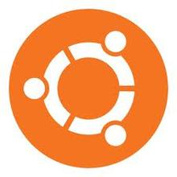

## 关于本笔记

随着高通量测序技术快速发展，适合开展微生物基因组测序等工作的小型台式测序仪将在各种临床，科研以及政府的小型实验室中逐渐普及，例如适合做细菌测序的例如 `Illumina Miseq`，`Ion S5`，适合做病毒测序的例如 `Ion PGM`，适合临床实验室开展靶向测序的 `Qiagen GeneReader` 及其整套流水实验工具，以及三代测序中逐渐浮出水面的基于纳米孔技术的长度长测序机器 `Oxford MinION` 等等。测序数据的不断产出，需要大量的生物信息学人才来参与到测序数据转换成可读数据以便用于各项工作中。不同于由测序公司负责开展的生物信息学分析，对于许多小型实验室来说，招募到优秀的生物信息学人员开展专业的数据分析是非常困难的事情。但除了科研工作外，大部分基本测序数据的分析已经有许多工具流来帮助实现。对于非专业背景的人来说，命令行以及软件的安装可能是学习曲线中较为陡峭的部分。

本书内容主要是介绍微生物，特别是病原细菌的高通量测序数据分析。目的也是为了能通过学习，帮助原来从事湿实验的同事能较好的掌握高通量测序数据分析，将学习曲线变得平缓。同时也希望能对从事该领域的其他工作者提供便利，让大家在需要分析微生物基因组数据时，能有一个资料与实例汇集的手册可以快速参考和学习。

内容上主要以台式测序仪 Illumina Miseq 以及其数据为基础。例子都是运行在安装了 Ubuntu 发行版的 Linux PC服务器以及个人电脑上。

 

本笔记使用开源工具 [Gitbook][] 创作，介绍的工具也几乎均为开源软件。笔记中的许多内容都是来源于网络上的资料，部分来源可能有误或记忆不全，如果原作者发现没有内容链接，或者链接错误，请发送 [电子邮件](mailto:indexofire@gmail.com) 通知修改。同时希望 [Open Source][] 思想能对科研工作和科研工作者有所帮助。

本笔记代码托管在 [Github][], 所有内容可以在 http://github.com/indexofire/bac-ngs-book.git 获得。笔者接触 NGS 时间不长，内容中肯定会有许多错误之处，希望能有NGS领域的专家帮助指正。欢迎大家提交 [issues](https://github.com/indexofire/bac-ngs-book/issues)，帮助完善笔记内容。

#### Fork笔记方法

1. 在GitHub上fork本书作为自己的仓库，如`indexofire/bac-ngs-book`，然后`git clone`到本地，并设置用户信息。
```
~$ git clone git@github.com:your_github_username/bac-ngs-book.git
~$ cd bac-ngs-book
~/bac-ngs-book$ git config user.name "your github username"
~/bac-ngs-book$ git config user.email your_email@something.com
```

2. 修改内容后提交，并`git push`到之前`fork`的仓库。
```
~/bac-ngs-book$ git commit -am "Fix issue #1: change typo: helo to hello"
~/bac-ngs-book$ git push
```

3. 在GitHub网站上提交`pull request`。

4. 定期使用项目仓库内容更新自己仓库内容。
```
~/bac-ngs-book$ git remote add upstream https://github.com/indexofire/bac-ngs-book.git
~/bac-ngs-book$ git fetch upstream
~/bac-ngs-book$ git checkout master
~/bac-ngs-book$ git merge upstream/master
~/bac-ngs-book$ git push origin master
```

## 版本更新

v0.0.1: 2016.01.01

 * reload

[Linux]: http://www.linux.com/ "Linux"
[Illumina]: http://www.illumina.com/ "Illumina"
[MiSeq]: http://www.illumina.com/search.ilmn?search=MiSeq&Pg=1&ilmn_search_btn.x=1 "MiSeq"
[gitbook]: http://www.gitbook.io/ "Git Book"
[Open Source]: http://opensource.org/ "开源思想"
[Linux]: http://www.linux.com/ "Linux"
[Github]: https://www.github.com/ "Github"
