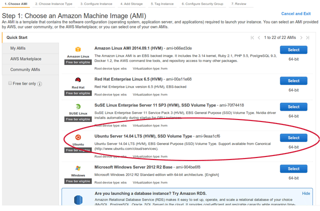
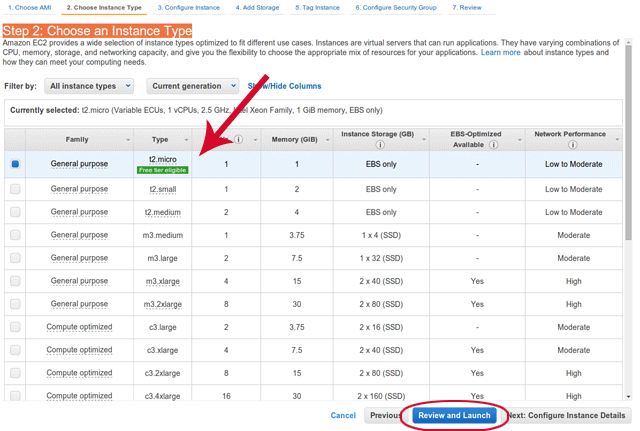

## Amazon EC2 教程

**Amazon Elastic Compute Cloud (Amazon EC2)** 是一种基于 AWS Web 的一项云服务，特点是可在云中提供大小可调的计算量。它的服务接口非常简单，您可以轻松获取和配置容量，可以完全控制您的计算资源，甚至可以直接挂载他人开发的生物信息学工具集合的镜像，减少部署时间。

**Amazon EC2** 启动新服务器实例的速度非常快，当您的计算要求发生变化时，您便可以快速扩展计算容量。服务按您实际使用的容量和计算量收费，还为开发人员提供了创建故障恢复应用程序以及排除常见故障情况的工具。总之，非常适合作为计算攻击来分析二代测序获得的大数据量分析。

**AWS** 的新客户可免费试用 **Amazon EC2**。注册后，新 AWS 客户在一年内每个月都将获得以下 EC2 服务：

1. 750 小时运行 Linux、RHEL 或 SLES t2.micro 实例的 EC2 使用时间
2. 750 小时运行 Microsoft Windows Server t2.micro 实例的 EC2 使用时间
3. 750 小时 Elastic Load Balancing 加上 15 GB 数据处理
4. 30 GB 的 Amazon Elastic Block Storage（以任意方式对通用型 (SSD) 或磁性介质型进行组合），附加 200 万次 I/O（采用磁性介质）和 5. 1 GB 快照存储
6. 适用于所有 AWS 服务的共计 15 GB 的带宽传出
7. 1 GB 区域数据传输

简而言之，新注册用户可以获得1年的有限免费使用。如果要偶尔使用的生产Instance，建议选择按按需实例。这样需要计算的时候打开，计算分析完成后关闭实例即可，可以最大程度上节约资源和开销。对于频繁使用的用户，可以申请`专用预留实例`，通过支付预付金，可以获得一定的折扣来减低成本。

#### 1. 注册申请

首先要去 https://aws.amazon.com/cn/ 注册一个帐号，帐号申请过程中会要求填写一张信用卡，并会电话联系确认卡的有效性。

用新注册帐号登录后，可以看到 **Amazon Web Services** 页面，上面列出了 Amazon 所有的服务内容。点击`Compute & Networking`里的`EC2`，可以进入你的`EC2 Dashboard`。

要注意的一点是，顶部工具栏在用户工具右侧有一个地区选项下拉菜单，可以选择不同区域的服务器。个人使用感受，亚洲的服务器比如东京和新加坡的连接速度最快，但是美国的服务器速度也很不错，比一般的VPS商售卖的要快的多！至于选择哪一个地区，可以根据自己的网络实际情况来选择，但是如果你要使用一些`AWS Public Datasets`，比如`Human genome project`或者`Genbank`之类的数据，需要添加`volume`的`snapshot`，这些`snapshot`往往是限定区域的。比如`Genbank`数据你只能在`us-east`区域使用，也就是说你要用这个`snapshot`，你必须把你的`Instance`建在`US East(N.Virginia)`区域。

#### 2. 建立 Instance
在`EC2 Dashboard`左侧列表里点击`Instances`，然后点击`Launch Instance`，会弹出如下图所示的一步步配置Instance的界面。

**2.1: Choose an Amazon Machine Image (AMI)**

在Image界面里选择*Ubuntu Server 14.04LTS*。



**2.2: Choose an Instance Type**

Type 选择 `t2.micro`
是因为这个配置是1年免费的。缺点当然是计算资源比较低，而且当你的计算资源超限额后，会自动把 CPU 性能降低到大概 1/10 左右的情况。要注意的是虽然是免费的，但本质上是1个月720hour的免费计算。如果你同时开了多个 t2.micro Instances，没有在不计算的时候停机stop，仍旧会超出计算时间，被扣美金的。所以如果开了多个Instances，千万别忘了不用的时候关闭。

然后就可以点击`review and launch`。如果想再定制其他配置可以点击`Next: Configure Instance Details`。当需要自动加载 `docker`，或者添加数据`Volumes`的时候要到后面的步骤里设置。



**2.3: Review Instance Launch`**

确认配置无误就点击 Launch，会弹出一个`Select an existing key pair or create a new key pair`选项窗口。这一步很重要，第一次建立新的 Instance 的话，下拉菜单选择`Create a new key pair`。然后给 key pair 取个好记的名字，比如**bac_ngs**，然后点击`Download Key Pair`，就会下载这个密钥文件到你的电脑上。名字叫**bac_ngs.pem**。这时候底部的`Launch Instance`按钮就变成可以点击状态，把你的鼠标按上去，你的Instance就开始初始化了。

#### 3. 访问 Instance
如果你的本地电脑操作系统是Linux，可以直接开一个终端程序运行ssh来访问Instance，如果是Windows电脑，推荐使用putty来访问。

**3.1 Linux**

将下载的 bac-ngs.pem 文件放在一个妥善的位置上，这里放在~/.pem

```
~/$ mkdir -p .pem
~/$ mv ~/downloads/bac-ngs.pem ~/.pem
~/$ chmod 400 ~/.pem/bac-ngs.pem
```

现在使用openssh远程访问 AWS Instance 实例。远程的地址可以使用 Dashboard 的 Instance 界面里对应的Public Domain 或者 IP 信息。因为选择的是 ubuntu 操作系统，直接使用 ubuntu 作为用户名，使用 bac-ngs.pem 密钥文件来登录。

```
~/$ ssh -i ~/.pem/bac-ngs.pem ubuntu@your_public_ip
```

连接成功的话就能看到 ubuntu 的登录欢迎界面，就可以开始你的生物信息软件配置过程了。

服务器和本地传递数据最方便的方法之一是使用scp命令，如果本地数据要传到服务器的`/home/ubuntu/data`位置上，可以用下面命令：

```
~/$ scp -i ~/.pem/bac-ngs.pem ~/data/your_data.fasta ubuntu@your_public_ip:/data
```

如果是要把服务器上`/home/ubuntu/data/001.tar.gz`文件传输给本地电脑的话，可以使用以下方式：

```
~/$ scp  ~/.pem/bac-ngs.pem ubuntu@your_public_ip:/data/001.tar.gz .
```

**3.2 Windows**

对于 windowsxp 或 windows7 可以使用 putty 来建立与 aws ec2 的 ssh 连接，参考这个[教程](http://ged.msu.edu/angus/tutorials-2013/log-in-with-ssh-win.html)。windows8 用户可以用 zoc 来访问，具体操作请自行搜索教程。

## Running docker in Amazon EC2

docker 是一种虚拟环境，可以很方便的在不同机器上配置环境，近年来快速发展，在云计算服务的领域被高度关注。事实上它的启动速度很快，配置也特别方便，很适合生物信息计算的自动化配置。它对生物学家最大的好处是直接使用他人创建的虚拟镜像，减少安装和部署的学习与工作曲线。或者根据自己的需求自己创建相应镜像，快速部署与使用。

#### 安装 docker

AWS 目前的各个 linux 发行版都已经支持 docker。你可以在上一部分创建好的 AWS EC2 Instance里安装docker:

```
ubuntu@public_ip:~$ sudo apt-get install docker.io
```

ubuntu 版本默认的安装包版本比较低，如果想安装最新版本的 docker，需要添加源：

```
$ sudo apt-key adv --keyserver hkp://keyserver.ubuntu.com:80 --recv-keys 36A1D7869245C8950F966E92D8576A8BA88D21E9
$ sudo bash -c "echo deb https://get.docker.io/ubuntu docker main > /etc/apt/sources.list.d/docker.list"
$ sudo apt-get update
$ sudo apt-get install lxc-docker
```

#### 运行 docker

接下来我们示例如何安装在docker hub 上他人开发的镜像，假设已经登录到 AWS 并已安装完 docker：

**1. 获取镜像**

首先我们用 docker 的搜索命令，查找含有名字 ngseasy-fastqc 的所有镜像。你会看到终端会打印出所有含有 ngseasy-fastqc 的镜像。

```
ubuntu@public_ip:~$ sudo docker search ngseasy-fastqc
```

因为 docker 镜像非常灵活，可以随时修改他人的镜像成为自己的，所以你旺旺能看到多个不同用户创建的相同镜像，这里我们能看到2个用户 snewhouse 和 compbio 创建的 ngseasy-fastqc 镜像。所以区别不同镜像是通过用*户名/镜像名:版本号*来区分的。如果不加版本号则已lastest作为默认。


```
NAME                                 DESCRIPTION
snewhouse/ngseasy-fastqc             NGSeasy fastqc
compbio/ngseasy-fastqc
```

下载镜像 snewhouse/ngseasy-fastqc。

```
ubuntu@public_ip:~$ sudo docker pull compbio/ngseasy-fastqc
```

**2. 启动容器**

启动容器有2种方式，我们需要在容器中进行交互，因此选择基于镜像新建容器并启动。

```
ubuntu@public_ip:~$ sudo docker run -t -i compbio/ngseasy-fastqc /bin/bash
root@32d858986db7:/# su pipeman
```

这样你可以开始输入 fastqc 运行程序。

####配置适合自己需求的镜像

**1. Base image**

首先我们需要建立 docker 账号，然后找一个 base image。这里我们用 ubuntu 来创建。首先搜索一下 docker hub 里的 ubuntu 官方镜像。

```
ubuntu@public_ip:~$ sudo docker search ubuntu | grep Official
```

**2. 创建Dockerfile**

docker 镜像在创建容器时，主要通过 Dockfile 来配置，本质上是一个类似 shell 脚本来建立部署的工作流。下面举一个最简单的安装 blast 的 dockerfile 例子。

Dockerfiles

```
FROM ubuntu:12.04
MAINTAINER My_Name my_email@mail.com

RUN apt-get update && apt-get dist-upgrade -y
RUN apt-get install -y blast
RUN apt-get autoclean && apt-get autoremove -y && rm -rf /var/lib/{apt,dpkg,cache,log}/
```

更完整的实例可以参考官方文档。

**3. 添加工具**

```
ubuntu@public_ip:~$
```

#### 进一步学习 Docker

如果想对 docker 有更深入的了解，可以先阅读 [Docker 从入门到实践](http://yeasy.gitbooks.io/docker_practice/)，或者阅读 [Docker 官方文档](https://docs.docker.com/)。关注 docker 技术的朋友推荐订阅

#### 可用镜像

国外有一些研究者建立了含有不同生物信息分析软件的 docker images，可以根据需要直接下载并运行，避免了在不同机器中部署的各种配置。比如：

1. [Docker Galaxy](https://github.com/bgruening/docker-galaxy-stable)
2. [KHP-Bioinformatics](https://github.com/KHP-Informatics/ngs)
