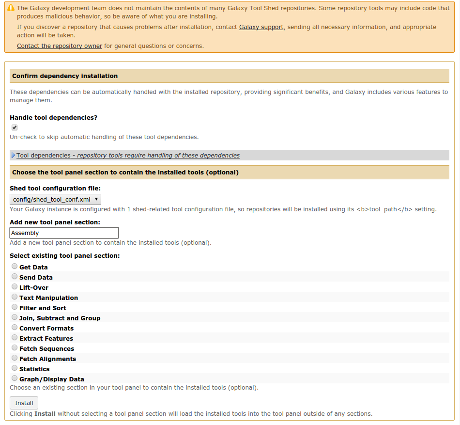

## 1. Galaxy 本地安装与配置

#### 下载与安装

galaxy 的代码库托管在 bitbucket.org ，先安装 mercurial ，然后用 hg 工具将 galaxy 代码库克隆到本地。

```
~app$ sudo apt-get install mercurial
~app$ hg clone https://bitbucket.org/galaxy/galaxy-dist/
~app$ cd galaxy-dist
```

可以用 `hg branch` 命令查看代码分支是否为 stable，如果是其他分支（galaxy代码库有另一分支'default'），切换到 stable 分支：`hg update stable`。在生产环境下建议使用 stable 分支的代码。

#### 配置与运行

克隆到本地的 stable 代码，一般Linux系统自带Python就可以直接运行了。

```
~app$ ./run.sh
```

运行 `run.sh`，这个shell脚本程序会自动完成初始化数据，依赖库下载，数据库迁移等一系列操作，当看到终端显示`serving on http://127.0.0.1:8080`时，可以打开浏览器，访问 http://127.0.0.1:8080 即可看到galaxy的界面。

## 2. 构建最基本的生产环境配置

作为个人尝试，前面的步骤在PC机上已经可以正常运行使用。对于要作为生产环境下多用户使用，建议使用专门的代理服务器和数据库来增强效率和速度。这里采用nginx+postgresql构建生产环境下的 Galaxy 服务。这里只是简单的介绍一下最基本的配置方式，对于高负载的web server设置又是另一个很复杂的话题了，这里就不具体展开。也可以参考别人做的[galaxy dockerfile](https://registry.hub.docker.com/u/bgruening/galaxy-stable/dockerfile/)。对于不熟悉服务器设置的用户，直接使用现成的galaxy docker也是一种方案。

首先在ubuntu下新建一个用户galaxy。

```
~$ sudo adduser galaxy
```

按照提示，在弹出提示符输入相应内容，主要填好密码即可，其他可以留空。然后切换到galaxy用户：

```
~$ su galaxy
~$ cd
```

重复`Galaxy 本地安装与配置`的第一步`下载与安装`步骤,建立配置文件：
```
~$ cp config/galaxy.ini.sample config/galaxy.ini
~$ vim config/galaxy.ini
```

将配置文件galaxy.ini设置如下，你也可以将内容直接保存成galaxy.ini

```
[server:main]
use = egg:Paste#http
host = 0.0.0.0
use_threadpool = True
threadpool_kill_thread_limit = 10800

[filter:gzip]
use = egg:Paste#gzip

[filter:proxy-prefix]
use = egg:PasteDeploy#prefix
prefix = /galaxy

[app:main]
paste.app_factory = galaxy.web.buildapp:app_factory
tool_dependency_dir = tool_dep
use_nglims = False
nglims_config_file = tool-data/nglims.yaml
debug = False
use_interactive = False
admin_users = admin@localhost.com
```

#### 安装 postgresql

安装postgresql并建立galaxy数据库

```
~$ sudo apt-get install postgresql-9.3
~$ su - postgres
~$ psql template1

> CREATE USER galaxy WITH PASSWORD 'galaxy';
> CREATE DATABASE galaxyserver;
> GRANT ALL PRIVILEGES ON DATABASE galaxyserver to galaxy;
> \q
```

#### 安装 nginx

用nginx做反向代理，处理请求。

```
~$ sudo apt-get install nginx
```

设置nginx.conf

```
http {
    upstream galaxy_app {
        server localhost:8080;
    }

    server {
        client_max_body_size 10G;
        location / {
            proxy_pass   http://galaxy_app;
            proxy_set_header   X-Forwarded-Host $host;
            proxy_set_header   X-Forwarded-For  $proxy_add_x_forwarded_for;
        }
    }
}
```

## 2. 添加第三方软件

默认的galaxy只带有基本的工具，对于实际工作中需要的各种分析软件，需要添加到自己建立的 galaxy 实例中。

高通量测序的生物信息学软件大多是基于命令行的开源工具。galaxy利用python语言将这些工具粘合到galaxy实例中，使得用户可以在web界面中直接调用命令行工具对数据进行操作。

galaxy有一个toolshed（工具库）的概念：`https://toolshed.g2.bx.psu.edu/`（官方维护的toolshed），许多著名的工具已经被移植到toolshed中，可以直接被安装到galaxy里，此外也有许多第三方的toolshed包可以添加，甚至掌握了一些python脚本和galaxy xml规范后，也可以自己添加一些分析工具到galaxy中。

除了分析软件外，toolshed还包含创建的数据类型，以及工作流等。

#### 添加官方 toolshed 中的工具

首先修改配置文件 `tool_sheds_conf.xml`

```
~$ cp config/tool_sheds_conf.xml.sample config/tool_sheds_conf.xml
```

其次在galaxy.ini中配置依赖包的安装目录（上一部分已经添加了这个参数，将依赖包安装在`tool_dep`），然后添加管理员帐号，比如你之前用admin@localhost.com注册的galaxy实例，就将galaxy.ini中`admin_users`设置为：

```
admin_users = admin@localhost.com
```

重启你的galaxy实例，用admin@localhost.com用户登陆，你就有权限访问`http://127.0.0.1:8080/admin`，在admin界面可以看到`Tool sheds`下有`Search and browse tool sheds`链接，点击后可以看到默认的2个toolsheds源。

进入`Galaxy main tool shed`，工具列表上访有搜索框，在这里输入你要安装的工具名称比如`spades`后，回车进行检索。


点击结果列表中的`spades`下拉菜单，选择`Preview and install`，在转向页面中点击`Install to Galaxy`后，会出现如下图的提示。



在`add new tool panel section`中输入`Assembly`，将`spades`工具归类到`Assembly`这个新建的工具类别中，点击页面底部的`Install`按钮开始安装。

## 3. 将 Galaxy 运行在 Amazon EC2

#### Reference

1. https://wiki.galaxyproject.org/
2. http://www.chenlianfu.com/?p=1469
3. http://methdb.univ-perp.fr/cgrunau/methods/Galaxy_production_mode_installation_walkthrough.html
